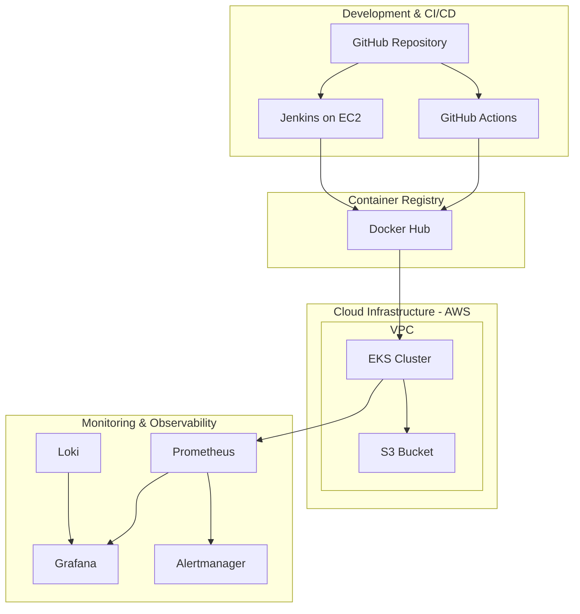
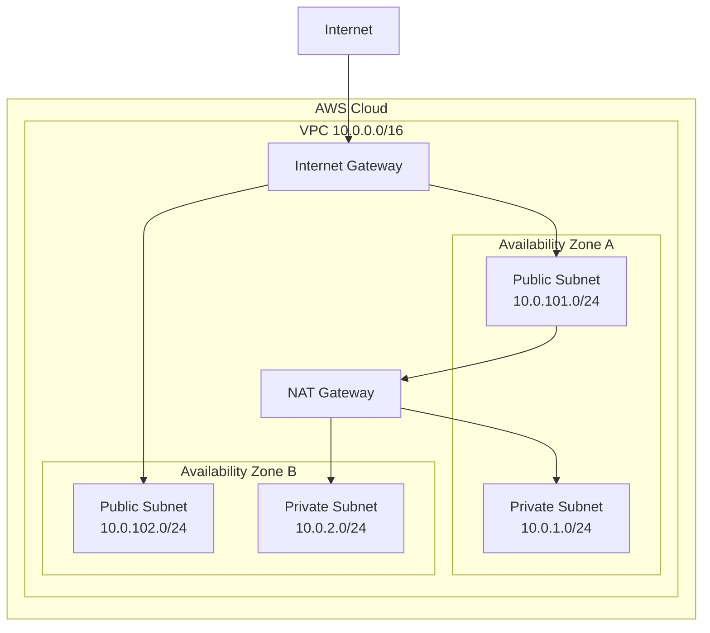
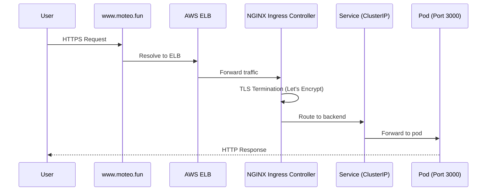

# Screenshot Guide for Technical_Report.md

## Total: 40 Figures

---

### Chapter 1: Overview & System Architecture
***DONE***
**Figure 1: High-Level System Architecture Diagram**
- **Type**: Diagram (Mermaid)
- **Action**: Create a Mermaid diagram showing 4 domains:
  1. Development & CI/CD (GitHub → GitHub Actions → Jenkins)
  2. Container Registry (Docker Hub)
  3. Cloud Infrastructure (AWS VPC → EKS Cluster → S3)
  4. Monitoring & Observability (Prometheus → Grafana → Loki → Alertmanager)
- **Tool**: Use [mermaid.live](https://mermaid.live) or VS Code Mermaid extension
- **Save as**: `images/figure01-architecture-diagram.png`

---

### Chapter 2: Infrastructure Provisioning
***DONE***
**Figure 2: Terraform Apply Output — Idempotency Verification**
- **Step 1**: Open terminal
- **Step 2**: `cd c:\Users\cbzer\DevOps_Final\infrastructure`
- **Step 3**: `terraform apply -auto-approve`
- **Step 4**: Wait for output showing "No changes. Your infrastructure matches the configuration."
- **Screenshot**: Capture the terminal showing "No changes" message
- **Save as**: `images/figure02-terraform-idempotency.png`
***DONE***
**Figure 3: VPC Network Topology Diagram**
- **Type**: Diagram (Mermaid)
- **Action**: Create Mermaid diagram showing:
  - VPC (10.0.0.0/16)
  - 2 Public Subnets (10.0.101.0/24, 10.0.102.0/24)
  - 2 Private Subnets (10.0.1.0/24, 10.0.2.0/24)
  - NAT Gateway in Public Subnet 1
  - Internet Gateway
  - EKS Worker Nodes in Private Subnets
- **Save as**: `images/figure03-vpc-topology.png`

**Figure 4: EKS Cluster and Node Groups**
- **Step 1**: Open AWS Console → EKS → Clusters → `devops-final-cluster`
- **Step 2**: Show cluster status "Active" and node group with 2 nodes
- **Alternative**: `kubectl get nodes -o wide` in terminal
- **Screenshot**: AWS Console showing cluster overview
- **Save as**: `images/figure04-eks-cluster.png`

**Figure 5: Jenkins Server on EC2 — AWS Console**
- **Step 1**: Open AWS Console → EC2 → Instances
- **Step 2**: Find Jenkins instance, show its Elastic IP and security group
- **Screenshot**: EC2 instance list with Jenkins instance highlighted
- **Save as**: `images/figure05-jenkins-ec2.png`

**Figure 6: Hostinger DNS Records**
- **Step 1**: Log in to Hostinger → DNS Zone Editor
- **Step 2**: Show CNAME for `www.moteo.fun` and A record for `jenkins.moteo.fun`
- **Screenshot**: DNS records table
- **Save as**: `images/figure06-hostinger-dns.png`

**Figure 7: GitHub Secrets Configuration**
- **Step 1**: Open GitHub → Repository → Settings → Secrets and variables → Actions
- **Step 2**: Show the configured secrets list
- **Screenshot**: Secrets page showing DOCKERHUB_USERNAME, DOCKERHUB_TOKEN, AWS_ACCESS_KEY_ID, AWS_SECRET_ACCESS_KEY
- **Save as**: `images/figure07-github-secrets.png`

---

### Chapter 3: CI/CD Pipeline Design

**Figure 8: GitHub Actions Pipeline — Full Run Overview**
- **Step 1**: Open GitHub → Repository → Actions tab
- **Step 2**: Select a successful workflow run
- **Step 3**: Show the overview with all 3 jobs (build-and-push, deploy-staging, deploy-production) passing
- **Screenshot**: Full pipeline run overview
- **Save as**: `images/figure08-github-actions-overview.png`

**Figure 9: CI Job — Expanded Steps**
- **Step 1**: Click on the `build-and-push` job to expand it
- **Step 2**: Show all steps: Checkout, Setup Node.js, npm ci, ESLint, Trivy, Docker Build & Push
- **Screenshot**: Expanded CI job with all steps passing
- **Save as**: `images/figure09-ci-job-expanded.png`

**Figure 10: Trivy Security Scan Output**
- **Step 1**: In the GitHub Actions run, expand the Trivy step
- **Step 2**: Show the scan summary with 0 CRITICAL, 0 HIGH vulnerabilities
- **Alternative**: Run locally: `trivy fs --severity CRITICAL,HIGH --ignore-unfixed application/`
- **Screenshot**: Trivy scan results table
- **Save as**: `images/figure10-trivy-scan.png`

**Figure 11: Docker Hub Registry — Version-Tagged Images**
- **Step 1**: Open [Docker Hub](https://hub.docker.com/r/dinhquoccuong286/devops-final-app)
- **Step 2**: Show the Tags tab with multiple commit-SHA tags (no 'latest' tag)
- **Screenshot**: Docker Hub tags page
- **Save as**: `images/figure11-docker-hub-tags.png`

**Figure 12: Staging Deployment Job**
- **Step 1**: In GitHub Actions, expand the `deploy-staging` job
- **Step 2**: Show kubectl apply commands and rollout status
- **Screenshot**: Staging deployment job output
- **Save as**: `images/figure12-staging-deploy.png`

**Figure 13: Manual Approval Gate — GitHub Environments**
- **Step 1**: In GitHub Actions, show the pipeline paused at "Review required" prompt
- **Step 2**: Show the approval button waiting for reviewer
- **Screenshot**: Manual approval gate UI
- **Save as**: `images/figure13-approval-gate.png`

**Figure 14: Automated Rollback on Health Check Failure**
- **Step 1**: In GitHub Actions, show a failed deployment with rollback
- **Step 2**: Show the output: "[FAIL] Production deployment failed! Rolling back..." + `kubectl rollout undo`
- **Alternative**: Simulate by deploying a bad image
- **Screenshot**: Rollback sequence in pipeline output
- **Save as**: `images/figure14-rollback.png`

**Figure 15: Jenkins Pipeline — Full Run**
- **Step 1**: Open `https://jenkins.moteo.fun`
- **Step 2**: Show the `devops-final` pipeline with all stages passing (blue)
- **Screenshot**: Jenkins pipeline full view
- **Save as**: `images/figure15-jenkins-pipeline.png`

**Figure 16: Jenkins Pipeline — Stage View**
- **Step 1**: Click into a specific Jenkins build
- **Step 2**: Show the Stage View with each stage and execution time
- **Screenshot**: Jenkins Stage View
- **Save as**: `images/figure16-jenkins-stage-view.png`

**Figure 17: Multi-Stage Docker Build Process**
- **Step 1**: Run `docker build -t test .` in the application directory
- **Step 2**: Show the two-stage build output (builder → final)
- **Step 3**: Run `docker images test` to show final image size
- **Screenshot**: Terminal showing multi-stage build output
- **Save as**: `images/figure17-docker-build.png`

---

### Chapter 4: Deployment and Orchestration

**Figure 18: Kubernetes Namespaces — Staging and Production**
- **Step 1**: Run `kubectl get namespaces`
- **Step 2**: Show `staging` and `production` namespaces
- **Screenshot**: Terminal output
- **Save as**: `images/figure18-namespaces.png`

**Figure 19: Deployment YAML — RollingUpdate Configuration**
- **Type**: Code screenshot
- **Step 1**: Open `kubernetes/deployment.yaml`
- **Step 2**: Highlight the RollingUpdate strategy section (maxUnavailable: 0, maxSurge: 1) and readiness probe
- **Screenshot**: VS Code showing the YAML file
- **Save as**: `images/figure19-deployment-yaml.png`

**Figure 20: HPA Status — Scaling from 2 to 5 Pods**
- **Step 1**: Run `kubectl get hpa -n production -w` in one terminal
- **Step 2**: Run the stress test: `node stress-test.js 200 https://www.moteo.fun`
- **Step 3**: Watch HPA scale from 2 to 5 replicas
- **Screenshot**: Terminal showing HPA scaling up
- **Save as**: `images/figure20-hpa-scaling.png`

**Figure 21: HPA YAML Configuration**
- **Type**: Code screenshot
- **Step 1**: Open `kubernetes/hpa.yaml`
- **Step 2**: Highlight the autoscaling/v2 API, CPU target 60%, memory target 70%
- **Screenshot**: VS Code showing the HPA YAML
- **Save as**: `images/figure21-hpa-yaml.png`

**Figure 22: Ingress Traffic Flow Diagram**
- **Type**: Diagram (Mermaid)
- **Action**: Create Mermaid sequence diagram showing:
  - User → www.moteo.fun → AWS ELB → NGINX Ingress Controller → Service (ClusterIP) → Pods
- **Save as**: `images/figure22-ingress-flow.png`

**Figure 23: TLS Certificate — Let's Encrypt via Cert-Manager**
- **Step 1**: Run `kubectl get certificate -n production` (show READY=True)
- **Step 2**: Open `https://www.moteo.fun` in browser, show padlock icon
- **Screenshot**: Terminal + browser padlock
- **Save as**: `images/figure23-tls-certificate.png`

**Figure 24: Self-Healing — Pod Deletion and Automatic Recovery**
- **Step 1**: Run `kubectl get pods -n production -w`
- **Step 2**: In another terminal, run `kubectl delete pod -n production <pod-name>`
- **Step 3**: Watch old pod terminating and new pod being created automatically
- **Screenshot**: Terminal showing the recovery sequence
- **Save as**: `images/figure24-self-healing.png`

**Figure 25: AWS S3 Bucket — Uploaded Product Images**
- **Step 1**: Open AWS Console → S3 → `devops-final-uploads-dqc28664`
- **Step 2**: Show uploaded images under `uploads/` prefix
- **Screenshot**: S3 bucket contents
- **Save as**: `images/figure25-s3-bucket.png`

**Figure 26: All Running Pods Across Namespaces**
- **Step 1**: Run `kubectl get pods -A`
- **Step 2**: Show all pods running across production, staging, ingress-nginx, cert-manager, monitoring
- **Screenshot**: Terminal output
- **Save as**: `images/figure26-all-pods.png`

**Figure 27: Monitoring Stack Pods**
- **Step 1**: Run `kubectl get pods -n monitoring`
- **Step 2**: Show Prometheus, Grafana, Alertmanager, kube-state-metrics, node-exporter
- **Screenshot**: Terminal output
- **Save as**: `images/figure27-monitoring-pods.png`

---

### Chapter 5: Monitoring, Observability, and Lessons Learned

**Figure 28: Grafana Dashboard — Kubernetes Compute Resources / Pod**
- **Step 1**: Port-forward Grafana: `kubectl port-forward -n monitoring svc/prometheus-grafana 3000:80`
- **Step 2**: Open `http://localhost:3000` → Login (admin/prom-operator)
- **Step 3**: Navigate to "Kubernetes / Compute Resources / Pod" dashboard
- **Step 4**: Filter by namespace=production
- **Screenshot**: Grafana dashboard showing CPU, memory, pod status
- **Save as**: `images/figure28-grafana-compute.png`

**Figure 29: Grafana Dashboard — Kubernetes / Networking**
- **Step 1**: In Grafana, navigate to "Kubernetes / Networking" dashboard
- **Step 2**: Show network I/O charts for production pods
- **Screenshot**: Grafana networking dashboard
- **Save as**: `images/figure29-grafana-networking.png`

**Figure 30: Alertmanager — Fired Alerts**
- **Step 1**: Port-forward Alertmanager: `kubectl port-forward -n monitoring svc/prometheus-kube-prometheus-alertmanager 9093:9093`
- **Step 2**: Open `http://localhost:9093`
- **Step 3**: Show fired alerts (trigger one by deleting a pod)
- **Screenshot**: Alertmanager UI showing DeploymentReplicasMismatch alert
- **Save as**: `images/figure30-alertmanager.png`

**Figure 31: Alerting Rules YAML — PrometheusRule**
- **Type**: Code screenshot
- **Step 1**: Open `kubernetes/alerting-rules.yaml`
- **Step 2**: Highlight all 4 alert definitions
- **Screenshot**: VS Code showing the alerting rules YAML
- **Save as**: `images/figure31-alerting-rules.png`

**Figure 32: Grafana Explore — Loki Log Queries**
- **Step 1**: In Grafana, go to Explore view
- **Step 2**: Select Loki as data source
- **Step 3**: Run query: `{namespace="production"} |= "error"`
- **Screenshot**: Grafana Explore with Loki log results
- **Save as**: `images/figure32-loki-logs.png`

**Figure 33: Custom Application Metrics — /metrics Endpoint**
- **Step 1**: Port-forward app: `kubectl port-forward -n production svc/devops-final-service 8080:80`
- **Step 2**: Run `curl http://localhost:8080/metrics`
- **Step 3**: Show custom metrics: moteo_http_requests_total, moteo_http_request_duration_ms, etc.
- **Screenshot**: Terminal showing /metrics output
- **Save as**: `images/figure33-app-metrics.png`

**Figure 34: ServiceMonitor YAML — Prometheus Auto-Discovery**
- **Type**: Code screenshot
- **Step 1**: Open `kubernetes/prometheus-scrape.yaml`
- **Step 2**: Highlight the ServiceMonitor configuration
- **Screenshot**: VS Code showing ServiceMonitor YAML
- **Save as**: `images/figure34-servicemonitor.png`

**Figure 35: GitHub Environment Protection — Production Reviewer**
- **Step 1**: Open GitHub → Settings → Environments → production
- **Step 2**: Show the "Required reviewers" configuration
- **Screenshot**: GitHub environment protection settings
- **Save as**: `images/figure35-github-env-protection.png`

**Figure 36: GitHub Contributors — Team Members**
- **Step 1**: Open GitHub → Insights → Contributors
- **Step 2**: Show the 3 team members and commit activity graph
- **Screenshot**: Contributors page
- **Save as**: `images/figure36-github-contributors.png`

**Figure 37: Deploy Script Execution — deploy.ps1 Output**
- **Step 1**: Run `powershell -ExecutionPolicy Bypass -File ".\deploy.ps1"`
- **Step 2**: Show the full output through all 8 steps
- **Screenshot**: Terminal showing deploy.ps1 execution
- **Save as**: `images/figure37-deploy-script.png`

**Figure 38: Destroy Script Execution — destroy.ps1 Output**
- **Step 1**: Run `powershell -ExecutionPolicy Bypass -File ".\destroy.ps1"`
- **Step 2**: Show Helm uninstall, 90s LB wait, K8s cleanup, terraform destroy
- **Screenshot**: Terminal showing destroy.ps1 execution
- **Save as**: `images/figure38-destroy-script.png`

**Figure 39: Setup Script — setup.sh Execution**
- **Step 1**: Run `.\setup.sh` (or show the script content)
- **Step 2**: Show installation of AWS CLI, Terraform, kubectl, Helm, Docker, Node.js
- **Screenshot**: Terminal showing setup.sh execution
- **Save as**: `images/figure39-setup-script.png`

**Figure 40: Stress Test — HPA Scaling Demonstration**
- **Step 1**: Open two terminals side by side
- **Terminal 1**: `kubectl get hpa -n production -w`
- **Terminal 2**: `node stress-test.js 200 https://www.moteo.fun`
- **Step 2**: Show RPS, latency, error stats + HPA scaling from 2 to 5 pods
- **Screenshot**: Both terminals showing the stress test and HPA scaling
- **Save as**: `images/figure40-stress-test.png`

---

## Mermaid Diagram Templates

### Figure 1: High-Level System Architecture


### Figure 3: VPC Network Topology


### Figure 22: Ingress Traffic Flow


---

## Quick Reference: Screenshot Hotkeys

| OS      | Screenshot Tool     | Hotkey                                 |
| ------- | ------------------- | -------------------------------------- |
| Windows | Snipping Tool       | Win+Shift+S                            |
| Windows | Print Screen        | PrtScn                                 |
| macOS   | Screenshot          | Cmd+Shift+4                            |
| VS Code | Terminal Screenshot | Terminal → Select → Right-click → Copy |

## Image Format Recommendations

- **Terminal screenshots**: PNG, crop to show only relevant output
- **AWS Console screenshots**: PNG, full browser window
- **GitHub screenshots**: PNG, browser window
- **Diagrams**: PNG, 1920x1080 resolution
- **Code screenshots**: PNG, VS Code with dark theme for readability

## File Naming Convention

Save all screenshots in the `images/` directory with this naming pattern:
```
images/figure<NN>-<descriptive-name>.png
```

Example: `images/figure01-architecture-diagram.png`
