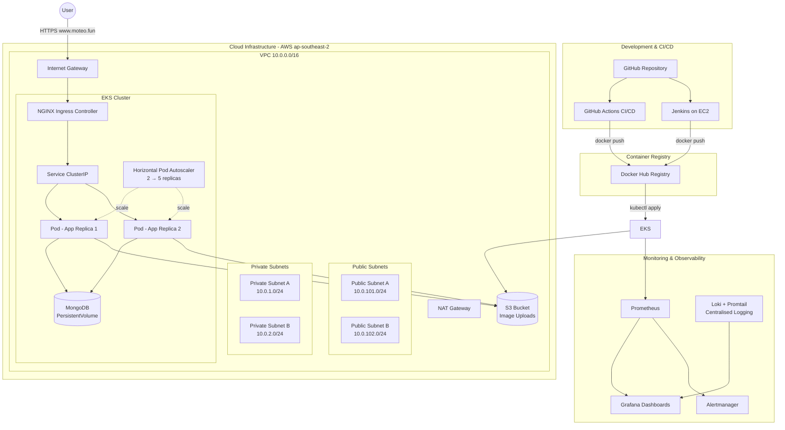
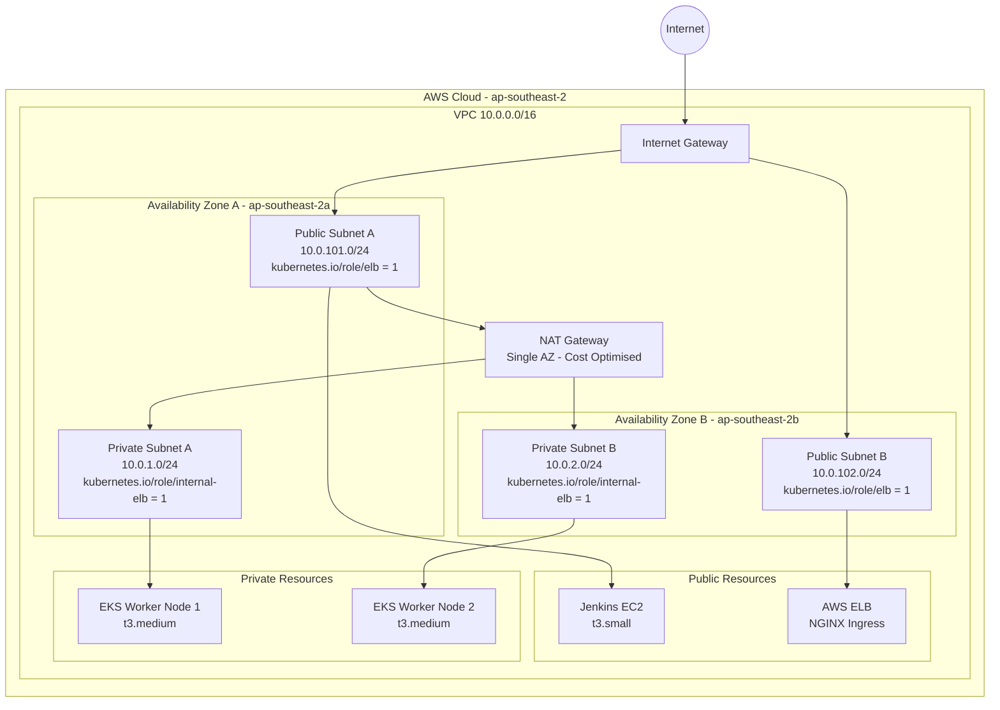
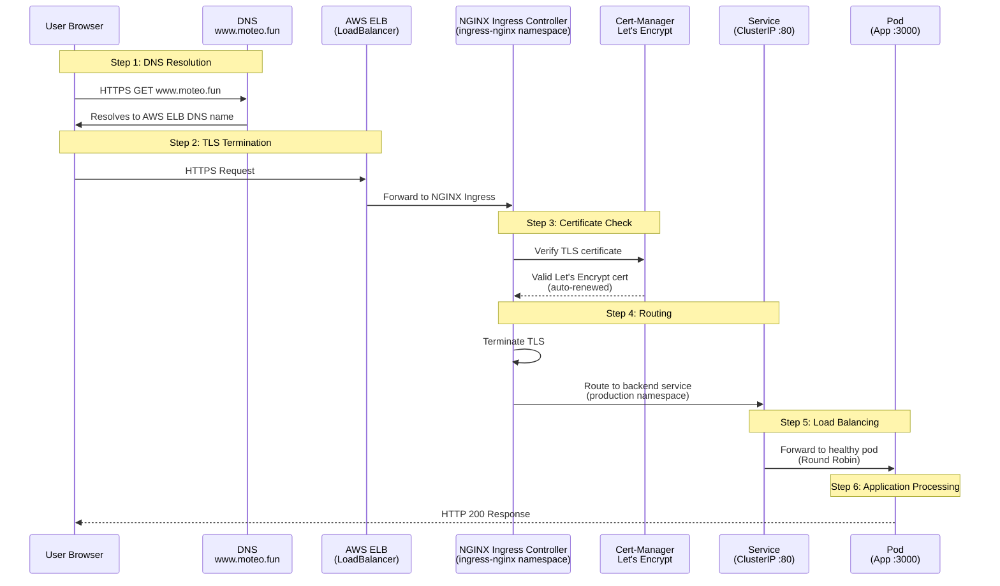
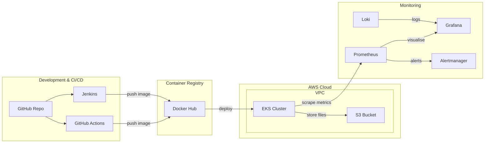
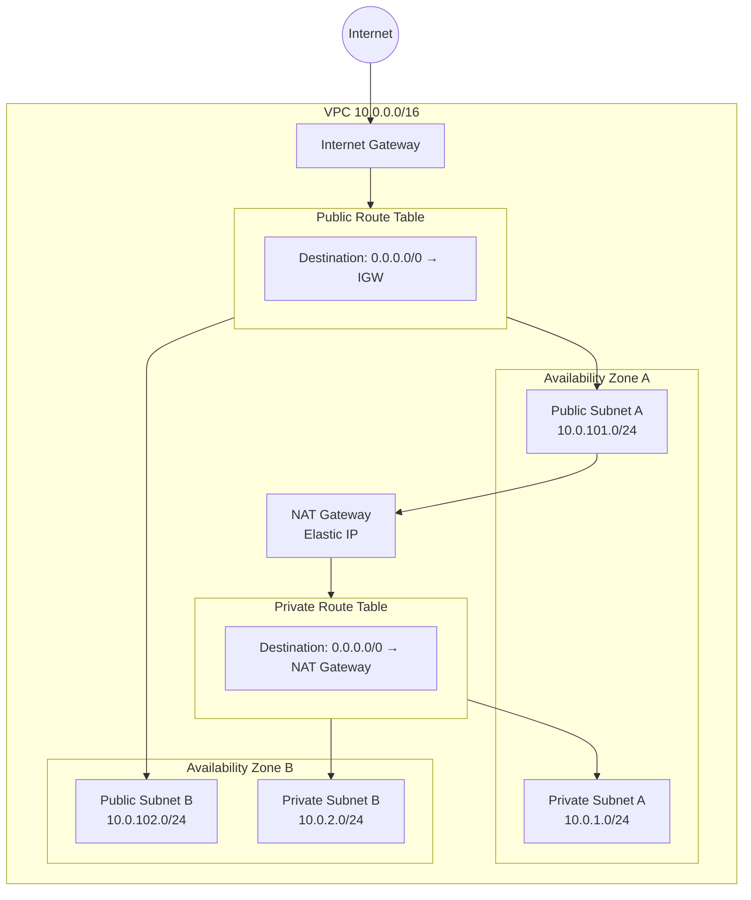
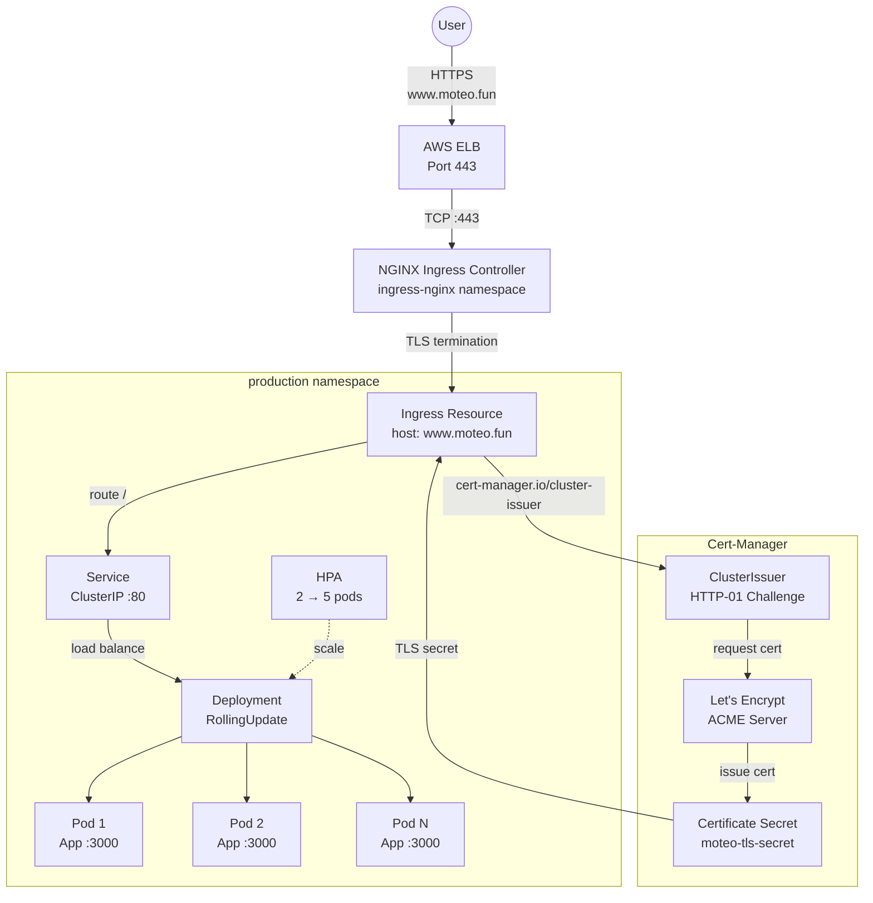

# Diagram Report — Mermaid Diagrams for Technical_Report.md

This file contains all diagram-based figures from the Technical Report as Mermaid code.
Render each diagram using [mermaid.live](https://mermaid.live) or a VS Code Mermaid extension, then save as PNG to `images/`.

---

## Figure 1: High-Level System Architecture Diagram

---

## Figure 3: VPC Network Topology Diagram

---

## Figure 22: Ingress Traffic Flow Diagram

---

## Figure 1 Alternative: Simplified Architecture (Flowchart Style)

---

## Figure 3 Alternative: VPC with Route Tables

---

## Figure 22 Alternative: Ingress with Detailed Components

---

## Usage Instructions

1. **Copy** any Mermaid code block above
2. Go to [mermaid.live](https://mermaid.live)
3. **Paste** into the editor
4. **Export** as PNG (or SVG)
5. **Save** to `images/` directory with naming:
   - `images/figure01-architecture-diagram.png`
   - `images/figure03-vpc-topology.png`
   - `images/figure22-ingress-flow.png`

### Alternative: VS Code Extension
1. Install **Markdown Preview Mermaid Support** extension
2. Open this file in VS Code
3. Right-click → **Open Preview**
4. Right-click on diagram → **Copy as PNG**
